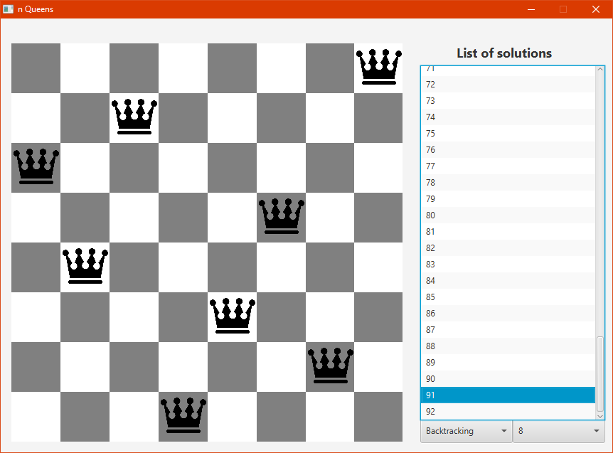

# n-Queens problem – desktop application
## Description
This application built for desktop uses the JavaFX library for graphic user interfaces, and its purpose is to show all possible solutions for the n-queens problem for a specific size of board.

The n-queens problem consists on the following, let’s suppose that we have a board of an ‘n’ quantity of  columns and  an ‘n’ quantity of rows, in other words, a square board, and we only are allowed to place an ‘n’ quantity of queen pieces, the only constraint that we have is that no two queen pieces can attack each other. The main issue with this problem is that the queen is the strongest piece on this game and its range of attack is really wide, so the goal is to find all possible permutations in which we can place all ‘n’ queen pieces on the board without forgetting the main constraint.

This application finds all possible solutions for the n-queens problem using the following types of algorithms:
* Brute force
* Backtracking

The options mentioned before were selected in order to compare the efficiency of both algorithms and to demonstrate that the latter can find all the solutions in less time since it performs a lower number of operations compared to the former.
## Technologies used:
* Java
* JavaFX
* Junit 5
## Screenshot
